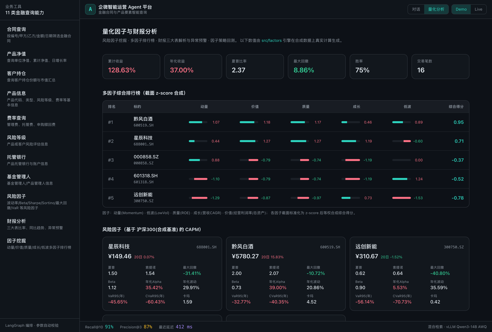
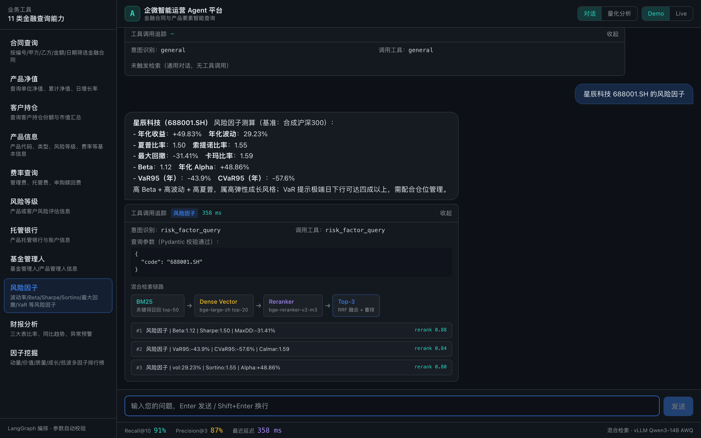

# 企微智能运营 Agent 平台

面向金融合同与产品要素查询的 Agent 原型，包含 FastAPI 后端、React 演示界面和企业微信加密回调接入。

**当前边界**：GitHub Pages 为静态演示；默认安装使用 BM25 检索，混合检索和 vLLM 需要额外依赖及模型。企微回调已实现本地验签/解密，主动发送回复尚未接通。量化页面使用确定性合成数据，不能据此判断投资效果。

## 核心能力

| 模块 | 技术方案 | 当前实现 |
|------|---------|------|
| PDF 结构化解析 | pdfplumber + PyMuPDF，跨页表格合并，字段标准化 | 表格与正文持久化、跨页表格恢复 |
| 混合检索 | BM25 + bge-large-zh + bge-reranker-v2-m3，RRF 融合 | 默认 BM25；向量召回与重排为可选依赖 |
| 多工具 Agent | LangGraph StateGraph，4 节点流水线 | 11 类业务工具，可追踪输出 |
| LLM 推理 | OpenAI 兼容 HTTP 接口，可连接 vLLM | 异步调用、精确请求缓存、有限重试 |
| 量化因子引擎 | CAPM 风险因子 + 多因子 z-score 排行榜（向量化、无前视） | Beta/Sharpe/Sortino/VaR/CVaR 等 12 项 |
| 财报分析 | 三大表解析 → 财务比率 → 同比趋势 → 异常预警 | ROE/毛利率/资产负债率等 11 项 |
| 因子回测 | 动量因子策略回测（A 股合规：warmup/次日均价/T+1/费用） | 标准三件套 + 专家仪表盘 |

## 项目结构

```
.
├── config/
│   └── settings.py          # 兼容导入（配置实际位于 src/config/）
├── src/
│   ├── config/              # 环境变量配置
│   ├── main.py              # FastAPI 入口 + 路由
│   ├── agents/
│   │   └── financial_agent.py   # LangGraph Agent 引擎
│   ├── tools/
│   │   └── business_tools.py    # 11 类业务工具
│   ├── factors/                 # 量化因子 + 财报分析
│   │   ├── demo_data.py         # 确定性合成行情/财报
│   │   ├── risk_factors.py      # 风险因子 + 多因子排行榜
│   │   ├── financial_report.py  # 三大表解析/比率/异常预警
│   │   ├── factor_backtest.py   # 动量因子回测(标准三件套+仪表盘)
│   │   └── dashboard/           # 回测仪表盘模板(专家提供)
│   ├── retrieval/
│   │   └── hybrid_retriever.py  # BM25+Vector+Rerank 检索管线
│   ├── parsers/
│   │   └── pdf_parser.py        # PDF 跨页表格解析器
│   ├── models/
│   │   └── llm_client.py        # vLLM 异步客户端(缓存/并发)
│   ├── services/               # 扩展服务
│   └── utils/                  # 工具函数
├── data/
│   ├── pdfs/                   # 原始 PDF 目录
│   ├── parsed/                 # 解析结果(JSON)
│   ├── vectors/                # ChromaDB 向量存储
│   └── eval/
│       └── sample_eval.json    # 评估数据集样本
├── scripts/
│   ├── start_vllm.sh           # vLLM 启动脚本
│   └── start_all.sh            # 一键启动全部服务
├── tests/
│   └── test_core.py            # 单元测试 + 集成测试
└── pyproject.toml              # 项目依赖
```

## 快速开始

### 1. 安装依赖

Python 3.12 或 3.13；前端需要 Node.js 20.19+ 或 22.12+。

```bash
uv sync --locked --extra dev
```

默认安装不下载向量模型，也不安装 vLLM。需要完整混合检索时执行 `uv sync --locked --extra dev --extra retrieval`；Linux GPU 上自托管模型再添加 `--extra inference`。模型文件、GPU/CUDA 兼容性与真实服务需在部署环境验证。

也可使用 `pip install -e ".[dev]"`，但该方式不使用 `uv.lock` 固定依赖版本。

### 2. 配置环境变量

```bash
cp .env.example .env
# 编辑 .env 填写实际配置
```

生产环境设置 `ENV=production` 和至少 32 字符的 `API_KEY`；业务接口使用 `Authorization: Bearer <API_KEY>`。开发环境未设置密钥时允许本地调试。`CORS_ORIGINS` 填写前端来源，使用 Pages 的 Live 模式时添加 `https://dev-belly.github.io`。

### 3. 启动服务

```bash
# 方式一：一键启动（vLLM + API）
bash scripts/start_all.sh [GPU_ID]

# 方式二：分别启动
bash scripts/start_vllm.sh 0      # GPU 0 启动 vLLM (port 8000)
uv run --locked uvicorn src.main:app --host 127.0.0.1 --port 9000 --reload
```

### 4. 使用 API

```bash
# 健康检查
curl http://localhost:9000/health

# 聊天接口
curl -X POST http://localhost:9000/api/chat \
  -H "Content-Type: application/json" \
  -d '{"message": "查询合同 HT20240315001 的信息"}'

# 构建索引
curl -X POST http://localhost:9000/api/index/build \
  -H "Content-Type: application/json" \
  -d '{"force_rebuild": true}'

# 运行评估
curl -X POST http://localhost:9000/api/eval \
  -H "Content-Type: application/json" \
  -d '{"eval_file": "data/eval/sample_eval.json"}'
```

API 文档：http://localhost:9000/docs

评估接口只接受 `data/eval` 下不超过 5 MB 的 JSON 数组，每条记录含 `query` 与 `relevant_texts`。Recall@K 按检索结果覆盖的标注文本比例计算，Precision@K 按前 K 条命中比例计算；样例仅展示格式，需要先建立对应文档索引。仓库未提供支持 91%/87% 或亚秒级延迟的实测报告。

## 11 类业务工具

| 工具名 | 功能 | 关键参数 |
|--------|------|---------|
| `contract_query` | 合同信息查询 | 合同编号、甲方、乙方、金额范围、日期 |
| `product_nav` | 产品净值查询 | 产品代码、名称、净值日期 |
| `customer_holding` | 客户持仓查询 | 客户ID/姓名、产品代码 |
| `product_info` | 产品基本信息 | 产品代码/名称 |
| `fee_query` | 费率查询 | 产品代码 |
| `risk_query` | 风险等级查询 | 目标(产品/客户) |
| `custody_bank` | 托管银行信息 | 产品代码 |
| `fund_manager` | 基金管理人信息 | 管理人名称 |
| `risk_factor_query` | 风险因子查询 | 标的代码、指定因子 |
| `financial_report_query` | 财报分析 | 标的代码 |
| `factor_mining` | 因子挖掘 / 多因子排行榜 | 返回前 N 名 |

### 量化与财报能力（由「回测明算」量化专家设计口径）

- **风险因子引擎** `src/factors/risk_factors.py`：年化收益/波动、Sharpe、Sortino、最大回撤、Calmar、
  Beta/Alpha(CAPM)、VaR/CVaR(历史模拟)、偏度/峰度；风格因子含动量(20/60/120 日)、低波。
- **多因子排行榜**：动量 / 价值 / 质量(ROE) / 成长(营收CAGR) / 低波，截面 z-score 标准化后等权合成综合得分。
- **财报分析** `src/factors/financial_report.py`：三大表 → ROE/ROA/毛利率/净利率/资产负债率/流动比率/速动比率/
  应收账款周转天数/经营现金流占比，并按阈值做异常预警（如毛利率<20%、资产负债率>70%、流动比率<1）。
- **因子回测** `src/factors/factor_backtest.py`：动量因子(ROC20/60) 策略回测，严格遵循
  信号第 i 日收盘生成、第 i+1 日开盘撮合（无前视）、warmup 隔离、A 股 T+1/整手、费用与期末强制平仓，
  产出 `<prefix>_equity.csv` / `<prefix>_trades.csv` / `<prefix>_summary.json` 三件套，并渲染专家仪表盘
  `data/backtest/index.html`。

```bash
# 复现因子计算与回测
python scripts/compute_demo.py                 # 打印全市场因子/财报数值(JSON)
python -m src.factors.factor_backtest --code 688001.SH --out data/backtest
```

## 性能优化策略

- **语义缓存**：TTLCache 对相同 prompt 复用结果，跳过 LLM 调用
- **异步并发**：httpx AsyncClient + Semaphore 控制最大并发数
- **Prefix Caching**：vLLM 开启前缀缓存减少重复计算
- **AWQ 量化**：4-bit 量化降低显存占用和推理延迟
- **连接池复用**：HTTP keep-alive 减少握手开销

## 运行测试

```bash
uv run --locked ruff check .
uv run --locked pytest -q
uv build --wheel --out-dir dist
```

---

## 前端 Web 界面 (`web/`)

带界面的网页端，部署在 GitHub Pages，无需后端即可 Demo 模式交互。

技术栈：Vite + React + TypeScript + Tailwind CSS

### 本地开发

```bash
cd web
npm ci
npm run dev          # http://localhost:5173
```

### 构建与部署

```bash
npm run build        # 产物输出到 web/dist/
```

**已上线**：https://dev-belly.github.io/wecom-agent-platform/

当前采用 **gh-pages 分支**部署（构建产物直接推送到 `gh-pages` 分支，GitHub Pages 从该分支提供服务）。该方式无需 `workflow` 权限即可发布。

`.github/workflows/ci.yml` 会验证后端 lint、测试、wheel 安装和前端类型检查/构建。Pages 发布仍需将 `web/dist/` 构建结果更新到 `gh-pages` 分支。

网页支持两种模式：
- **Demo 模式**（默认）：内置样例数据，模拟检索链路与工具调用追踪；指标为演示值
- **Live 模式**：填写后端 API 地址及 API Key（仅保留于当前浏览器会话），连接真实服务；检索质量显示未评估

### 界面构成

| 区域 | 内容 |
|------|------|
| 顶栏 | 项目标题、对话/量化分析视图切换、Demo/Live 模式切换、后端地址配置 |
| 侧边栏 | 11 类业务工具列表（高亮当前调用） |
| 聊天面板 | 用户/助手消息气泡、建议提问、加载动画 |
| 工具追踪 | 可折叠卡片：意图识别、调用工具、校验参数、检索链路可视化 |
| 量化分析 | 多因子排行榜、风险因子卡片、财报三大表可视化、因子回测 KPI |
| 指标栏 | Recall@10、Precision@3、最近延迟 |

## 界面预览

> 线上体验（GitHub Pages）：https://dev-belly.github.io/wecom-agent-platform/

### 量化分析页（含内嵌回测仪表盘）


### 对话页（因子查询 + 工具调用追踪）


## 项目结构（完整）

```
.
├── web/                    # 前端 Web 界面（GitHub Pages 部署）
│   ├── src/
│   │   ├── components/     # 聊天/侧栏/追踪/指标等组件
│   │   ├── demo/           # Demo 模式样例数据
│   │   ├── api/            # 后端 API 客户端
│   │   └── App.tsx
│   └── vite.config.ts
├── src/                    # Python 后端（FastAPI + LangGraph + vLLM）
├── config/                 # 全局配置
├── data/                   # PDF / 解析结果 / 向量 / 评估
├── scripts/                # vLLM + 服务启动脚本
├── tests/                  # 单元测试 + 集成测试
└── .github/workflows/      # 后端与前端质量检查
```
